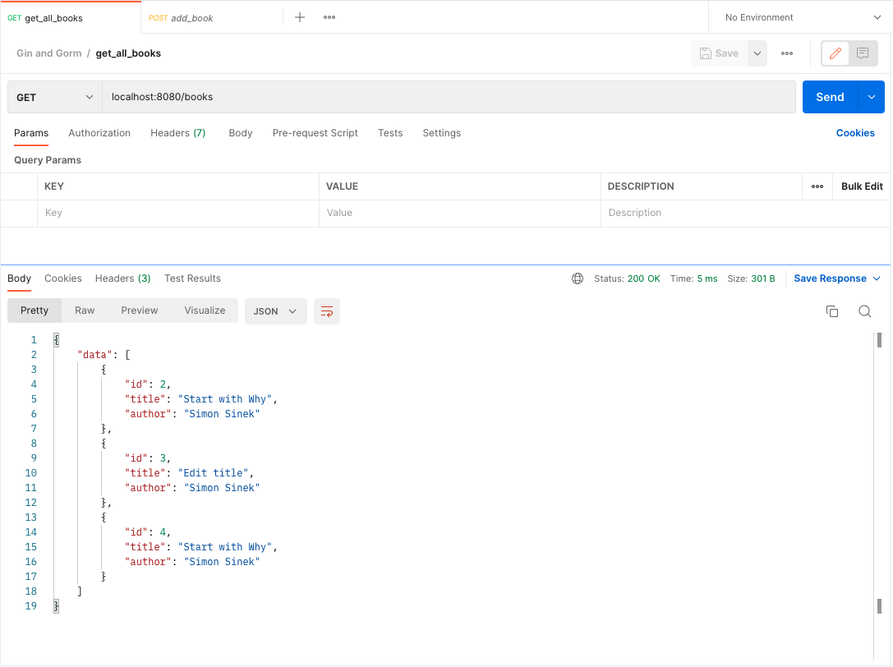

## Referenced link
https://blog.logrocket.com/how-to-build-a-rest-api-with-golang-using-gin-and-gorm/


A fantastic open-source project called Gin.
This framework is lightweight, well-documented, and, of course, extremely fast.

```sh
go mod init gin_gorm
go get github.com/gin-gonic/gin github.com/jinzhu/gorm
```
Get Sqlite3
```sh
go get github.com/jinzhu/gorm/dialects/sqlite@v1.9.16
```


## How to run
```sh
go run main.go
```

### Test



